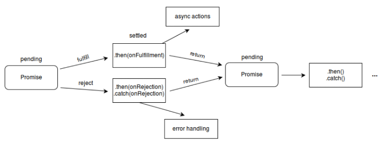

# Promise

以前在前端开发时会有一种情况：一个请求需要依赖另一个请求，如此循环嵌套，就形成了网络请求的回调地狱。

```javascript
$.ajax('url1', function(data1) {
  // 一些逻辑处理 ...
  $.ajax('url2', function(data2) {
    // 一些逻辑处理 ...
    $.ajax('url3', function(data3) {
      // 一些逻辑处理 ...
      $.ajax('url4', function(data4) {
        // 一些逻辑处理 ...
      })
    })
  })
})
```

上面的代码虽然有点夸张，但是确实反应了那个时代的`真实`。这样的代码虽然说一般情况下不会出现问题，但是一旦出问题，排查问题的难度比较高，不好定位，而且这样的代码不仅难看还不容易维护，需要使用一种更加优雅的方式来进行这种异步操作。

## 什么是Promise

ES6中一个非常重要的和好用的特性就是Promise。

**Promise是异步编程的一种解决方案**。它用于表示一个异步操作的最终完成(或失败)及其结果值。

一个`Promise`对象代表一个在这个 promise 被创建出来时不一定已知的值。它让您能够把异步操作最终的成功返回值或者失败原因和相应的处理程序关联起来。 这样使得异步方法可以像同步方法那样返回值：异步方法并不会立即返回最终的值，而是会返回一个 promise，以便在未来某个时候把值交给使用者。

一个 Promise 必然处于以下几种状态之一：

- ***待定（pending）***: 初始状态，既没有被兑现，也没有被拒绝。
- ***已兑现（fulfilled）***: 意味着操作成功完成。
- ***已拒绝（rejected）***: 意味着操作失败。

待定状态的 Promise 对象要么会通过一个值被兑现（fulfilled），要么会通过一个原因（错误）被拒绝（rejected）。当这些情况之一发生时，我们用 promise 的 then 方法排列起来的相关处理程序就会被调用。如果 promise 在一个相应的处理程序被绑定时就已经被兑现或被拒绝了，那么这个处理程序就会被调用，因此在完成异步操作和绑定处理方法之间不会存在竞争状态。

```javascript
new Promise((resolve, reject) => {
  setTimeout(() => {
    // 成功的时候调用 resolve
    resolve('success')
    // 失败的时候调用 reject
    reject('error')
  }, 1000)
}).then(data => {
  // 这里处理 resolve 传过来的数据
  console.log(data)
}).catch(err => {
  // 这里处理 reject 传过来的数据
  console.log(err)
})
```



## `Promise.prototype.then()`

`then()` 方法返回一个`Promise`。它最多需要有两个参数`Promise`的成功和失败情况的回调函数。

1. 语法

    ```javascript
    p.then(onFulfilled[, onRejected])

    p.then(value => {
      // fulfillment
    }, reason => {
      // rejection
    })
    ```

2. 参数

   - `onFulfilled`可选

       当 Promise 变成接受状态（fulfilled）时调用的函数。该函数有一个参数，即接受的最终结果（the fulfillment  value）。如果该参数不是函数，则会在内部被替换为 (x) => x，即原样返回 promise 最终结果的函数

   - `onRejected`可选

       当 Promise 变成拒绝状态（rejected）时调用的函数。该函数有一个参数，即拒绝的原因（rejection reason）。  如果该参数不是函数，则会在内部被替换为一个 "Thrower" 函数 (it throws an error it received as argument)。

3. 返回值

    当一个`Promise`完成（fulfilled）或者失败（rejected）时，返回函数将被异步调用（由当前的线程循环来调度完成）。具体的返回值依据以下规则返回。如果 then 中的回调函数：

    - 返回了一个值，那么 then 返回的 Promise 将会成为接受状态，并且将返回的值作为接受状态的回调函数的参数值。
    - 没有返回任何值，那么 then 返回的 Promise 将会成为接受状态，并且该接受状态的回调函数的参数值为 undefined。
    - 抛出一个错误，那么 then 返回的 Promise 将会成为拒绝状态，并且将抛出的错误作为拒绝状态的回调函数的参数值。
    - 返回一个已经是接受状态的 Promise，那么 then 返回的 Promise 也会成为接受状态，并且将那个 Promise 的接受状态的回调函数的参数值作为该被返回的Promise的接受状态回调函数的参数值。
    - 返回一个已经是拒绝状态的 Promise，那么 then 返回的 Promise 也会成为拒绝状态，并且将那个 Promise 的拒绝状态的回调函数的参数值作为该被返回的Promise的拒绝状态回调函数的参数值。
    - 返回一个未定状态（pending）的 Promise，那么 then 返回 Promise 的状态也是未定的，并且它的终态与那个 Promise 的终态相同；同时，它变为终态时调用的回调函数参数与那个 Promise 变为终态时的回调函数的参数是相同的。

## `Promise.prototype.catch()`

`catch()`方法返回一个`Promise`，并且处理拒绝的情况。它的行为与调用`Promise.prototype.then(undefined, onRejected)`相同。 (事实上, calling `obj.catch(onRejected)`内部 calls `obj.then(undefined, onRejected))`。

1. 语法

    ```javascript
    p.catch(onRejected);

    p.catch(function(reason) {
      // 拒绝
    })
    ```

2. 参数

   - onRejected
       当Promise 被rejected时,被调用的一个Function。 该函数拥有一个参数：
       reason    rejection 的原因。
       如果 onRejected 抛出一个错误或返回一个本身失败的 Promise ，  通过 catch() 返回的Promise 被rejected；否则，它将显示为成功（resolved）。

3. 返回值

    一个`Promise`
