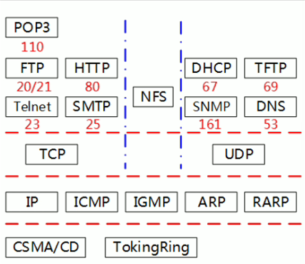

# 网络与多媒体基础知识

---
HTTPS：全称`Hyper Text Transfer Protocol over Secure Socket Layer`，是以安全为目标的HTTP通道，简单讲就是HTTP的安全版。HTTPS在HTTP的基础上加入了SSL协议，SSl依靠证书来验证服务器的身份，并为浏览器和服务器之间的通信加密。

---
数字签名技术是不对称加密算法的典型应用。数字签名是对签名真实性的保护。

---
ARP攻击（ARP欺骗）是欺骗攻击的一种，通过伪造IP地址和MAC地址，能过在网络中产生大量的ARP通信量使网络阻塞，如果伪造网关的IP地址和MAC对，则所有发往网关的IP包将因为MAC地址错误而无法到达网关（ARP攻击一般会将MAC地址改为发起ARP攻击的追加地址），造成无法跨网段通信。处理ARP攻击的方法为首先断开ARP攻击主机的网络连接，然后用"arp-d"命令清楚受攻击影响的ARP缓存。

---
SSH为Secure Shell的错写，由IETF的网络小组（Network Working Group）所制定；SSH为建立在应用层基础上的安全协议。SSH是目前较可靠，专为远程登录会话和其他网络服务提供安全性的协议。利用该协议可以有效的防止远程管理过程中的信息泄露问题。

---
矢量图是根据集合图特性来绘制图形，矢量可以是一个点或一条线，矢量图只能靠软件生成，文件占用内在空间较小，因为这种类型的图像文件包含独立的分离图像，可以自由无限制的重新组合。它的特点是放大后图像不会失真，和分辨率无关，使用一图新设计、文字设计和一些标志设计、版式设计等。

矢量图中的图形元素称为图元。

位图图象采用像素来表示图像。

---
视频信息是值活动的、连续的图像序列。一幅图像成为一帧，帧是构成视频信息的基本单元。

---
web方式收发电子邮件是必须设置账号密码登录

---
声音是由许多频率不同的信号组成，通常称为符合信号，而把单一频率的信号称为分量信号。声音信号的一个重要参数就是带宽（Bandwidth），它用来描述组成声音的信号的频率范围。

人耳能听到的音频信号频率范围是20Hz~20kHz，低于20Hz称为亚音信号（次音信号），高于20kHz的称为超音频信号（超声波）。

---
多媒体的“媒体”有两重含义：一是信息的物理载体，及存储和传递信息的实体，如手册、磁盘、光盘、磁带等；二是指承载信息的载体，及信息的表现形式（传播形式），如声音、文字、图像、动画等。

---
MIC（话筒）输出的是音频模拟信号，声卡通过模数转换器（ADC）将声波振幅信号采样转成一串数字信号并存储到计算机中。重放时，通过数模转换器（DAC）还原为模拟波形，送到扬声器发声，这一技术为脉冲编码调制技术（PCM）。

---
媒体分类：

- 感觉媒体：作用于人的器官
- 表示媒体：表示感觉媒体的数据编码
- 表现媒体：媒体输入输出设备
- 存储媒体：存储表示媒体的物理介质
- 传输媒体：传输表示媒体的物理介质

---
`MPEG-1`被应用到 VCD，`MPEG-2`被应用到 DVD，`MPEG-7`是多媒体内容描述接口

---
计算机中使用的图像压缩编码方法有多种国际标准和工业标准。目前官方使用的编码即压缩标准由JPEG、MPEG和H.261。

---
计算机数字音乐合成技术主要由FM和Wave Table。后者音质更好。

---
`图像数据量=图像总像素x图像深度(b)`

---
亮度：发光体（反光体）表面发光（反光）强弱的物理量。

色调：色彩的总体倾向。

饱和度：色彩的鲜艳程度，就是色彩的纯度。

---
建立连接进行可靠通信在TCP/IP网络中，应该在传输层完成，在OSI/RM同样在传输层完成

---
集线器连接的所有主机构成以一个冲突域，交换机的每个端口属于一个冲突域，路由器连接的每个部分网络形成一个广播域。

---
IP地址，在网络中的主机地址使用IP地址来唯一标识。每个IP地址由四个小于256的在数字组成，数字之间用`.`分开。IP地址共有32位，4个字节。有十进制(`127.0.0.1`)和二进制(`10000000 00000000 00000000 00000001`)两种格式。

- A类地址：网络地址占有1个字节(8位)，最高位为0，其余7位为真正的网络地址，支持1~126个网络。后面3个字节为主机地址，有2^(8x3)-2个端点
- B类地址：网络地址占有2个字节，最高位为10，其余14位为真正的网络地址。后面2个字节16位为主机地址。
- C类地址：网络地址占有3个字节，最高位为110，其余21位为真正的网络地址。后面1个字节8位位主机地址。
- D类地址：识别头是1110，用于组播。
- E类地址：识别头为1111，为实验保留。

在IP地址中，全0表示的是网络，全1表示的是广播。

`IP地址和子网掩码做逻辑与运算得到网络地址。`

`子网个数=2^(子网掩码的网络位数-该类的子网掩码位数)`

> 220.17.192.0/20划分了__个子网，子网的第三字节的范围是__。
>
> 1. 220 -> 110xxxxx，属于C类地址，应该有24位子网掩码，现在采用20位子网掩码，少了4位，所以子网数量为2^4=16
> 2. 子网第三字节的范围应当是`192+0 ~ 192+15`

---
ARP实现IP地址与MAC地址之间的变换

---
IPv6用128位二进制表示，能够表示的地址空间是2^128

IPv4用32位二进制表示，能够表示的地址空间是2^32

要使两个IPv6结点可以通过现有的IPv4网络进行通信，则应该使用隧道技术，如果要使纯IPv6结点可以与纯IPv4进行通信，则需要使用翻译技术。

---
|指令|说明|
|---|---|
|netstat|监控TCP/IP网络，-a：查看连接状态，-r：打印当前计算机路由表|
|nslookup|监测网络中DNS服务器是否能正常实现域名解析的命令行工具|
|ping|常用于测试连通性|
|ipconfig|查看主机TCP/IP情况|
|tracert|路由跟踪|
|route|显示当前计算机路由表|

nslookup、ping、tracert 都可以加上主机域名作为其命令参数来诊断DNS故障

使用ping进行网络检测，按照由近及远原则，首先执行`ping 127.0.0.1`，其次`ping 本地IP`，再次`ping 默认网关`，最后`ping 远程地址`。

---
URL由部分组成：资源类型、存放资源的主机域名、资源文件名，其格式为：`protocol://hostname[:port]/path/filename`

---
TCP/IP协议栈中协议与层次的关系：

---
MIME是一个互联网标准，扩展了电子邮件标准，使其能够支持多媒体数据。

---
DHCP客户端可以从DHCP服务端获得本机IP地址、DNS服务器的地址、DHCP服务器的地址、默认网关的地址等，但是没有Web
服务器、邮件服务器地址。

---
<table>
<thead>
  <tr>
    <td>OSI 七层网络模型</td>
    <td>TCP/IP 五层协议</td>
    <td>TCP/IP 四层概念模型</td>
    <td>对应网络协议</td>
    <td>设备</td>
  </tr>
</thead>
<tbody>
  <tr>
    <td>应用层(Application)</td>
    <td rowspan=3>应用层</td>
    <td rowspan=3>应用层</td>
    <td>HTTP、TFTP, FTP, NFS, WAIS、SMTP</td>
    <td rowspan=4>网关</td>
  </tr>
  <tr>
    <td>表示层(Presentation)</td>
    <td>Telnet, Rlogin, SNMP, Gopher</td>
  </tr>
  <tr>
    <td>会话层(Session)</td>
    <td>SMTP, DNS</td>
  </tr>
  <tr>
    <td>运输层(Transport)</td>
    <td>运输层</td>
    <td>运输层</td>
    <td>TCP, UDP</td>
  </tr>
  <tr>
    <td>网络层(Network)</td>
    <td>网络层</td>
    <td>网际层IP</td>
    <td>IP, ICMP, ARP, RARP, AKP, UUCP</td>
    <td>路由器</td>
  </tr>
  <tr>
    <td>数据链路层(Data Link)</td>
    <td>数据链路层</td>
    <td rowspan=2>网络接口层</td>
    <td>FDDI, Ethernet, Arpanet, PDN, SLIP, PPP</td>
    <td>网桥、交换机</td>
  </tr>
  <tr>
    <td>物理层(Pyysical)</td>
    <td>物理层</td>
    <td>IEEE 802.1A, IEEE 802.2到IEEE 802.11</td>
    <td>网卡、网线、集线器、中继器、调制解调器</td>
  </tr>
</tbody>
</table>

- 设备
  - 中继器是物理层设备，对接收到的信号进行再放大，以延长传输距离。
  - 网桥是数据链路层设备，可以识别MAC地址，进行帧转发。
  - 交换机是硬件构成的多端口网桥，也是数据链路层的设备。
  - 路由器是网络层的设备，识别IP地址，进行数据包的转发。
- TCP与UDP的区别
  - TCP：面向连接，连接三次握手，断开四次挥手，传输可靠，适合传输大量数据
  - UDP：无连接，传输不可靠，通信开销小，适合传输少量数据
