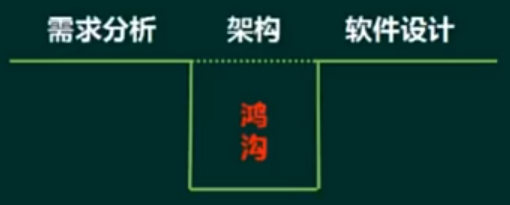
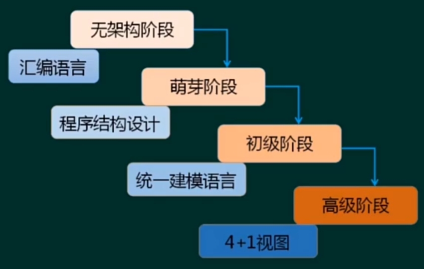
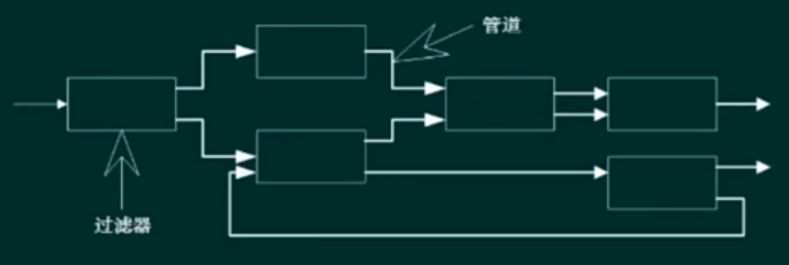
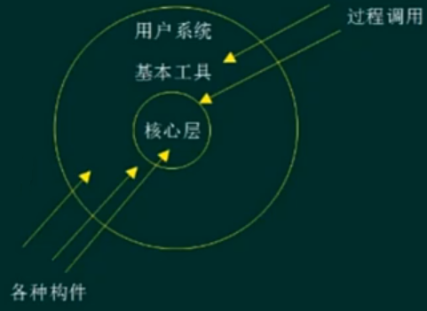
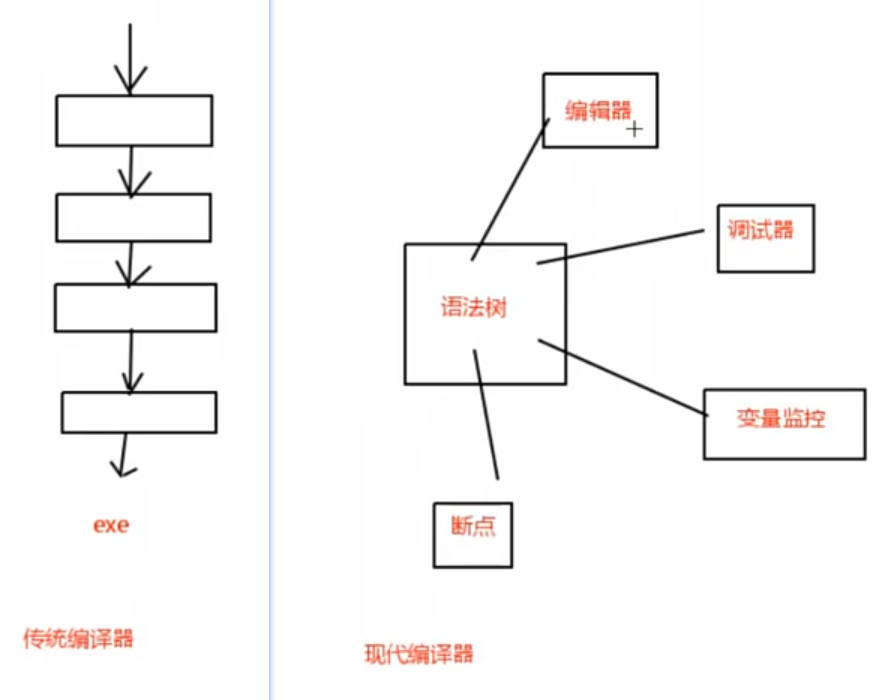
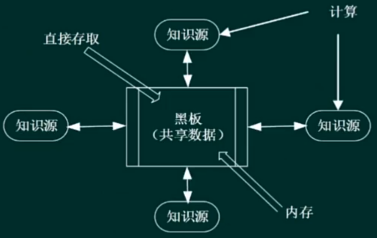

# 软件架构设计

## 软件架构的概念

> - 需求分析偏向于`业务`,软件设计偏向于`技术`，架构成为了处理其关系的桥梁
> - 架构设计就是需求分配，即将满足需求的职责分配到组件上

**架构 = 体系结构**

- 软件架构风格是描述某一特定应用领域中系统组织方式的管用模式。架构风格定义一个系统家族，即一个体系结构定义一个词汇表和一组约束。词汇表中包含一些构件和连接件类型，而这组约束指出系统是如何将这些构件和连接件组合起来的
- 软件架构为软件系统提供了一个结构、行为和属性的高级抽象，由构成系统的元素的描述、这些元素的相互作用、指导元素集成的模式以及这些模式的约束组成
- 软件架构是项目干系人进行交流的手段，明确了对系统实现的约束条件，决定了开发和维护组织的组织结构，制约者系统的质量属性
- 软件架构使推理和控制的更改更加简单，有助于循序渐进的原型设计，可以作为培训的基础
- 软件架构是可传递和可复用的模型，通过研究软件架构可能预测软件的质量

### 软件架构的发展史

### 软件架构建模
- `结构模型（静态）`：以架构的构件、连接件和其他概念来刻画结构
- 框架模型：不太侧重描述结构的细节而更侧重于整体的结构
- `动态模型`：系统的“大颗粒”的行为性质
- 过程模型：构建系统的步骤和过程
- 功能模型：由一组功能构件按层次组成，下层向上层提供服务

#### 4+1模型

> - 对应的UML的4+1视图
> - 关注点：
>   - 逻辑视图 → 系统功能
>   - 开发试图 → 源代码、组件、DLL
>   - 进程试图 → 并发
>   - 物理视图 → 软件到硬件的映射关系

## 软件架构的风格

- 架构设计的一个核心问题是能否达到架构级的复用
- 架构分风格反映了领域中众多系统所共有的结构和语义特征，并指导如何将各个构建有效的组织成一个完整的系统
- 架构风格定义了用于描述系统的术语表和一组指导构建系统的规则

分类：
- 数据流风格：批处理序列、管道-过滤器
- 调用/返回风格：主程序/子程序、面向对象、层次结构
- 独立构件风格：进程通信、事件驱动系统（隐式调用）
- 虚拟机风格：解释器、基于规则的系统
- 仓库风格：数据库系统、超文本系统、黑板系统
> 仅仅只是分类，实际使用一般不可能只用单一类型

### 数据流风格

> 特点：数据处理、严格流程
- 批处理序列
  - 构件为一系列固定顺序的计算单元，构件之间只通过数据传递交互。每个处理步骤是一个独立的程序，每一步必须在其前一步结束后才能开始，`数据必须是完整的，以整体的方式传递`
- 管道-过滤器
  - 每个构件都有一组输入和输出，构件读书如的数据流，经过内部处理，如何产生输出数据流。这个过程通常是对输入数据流变换或计算来完成的，包括通过计算和增加信息以丰富数据、通过浓缩和删除以精简数据、通过改变记录方式以转化数据和传递地转化数据等。这里的构件称为过滤器，连接件就是数据流传输的管道，将一个过滤器的输出传输到另一个过滤器的输入
  - `早期编译器就是采用的这种架构。要一步一步处理的，均可考虑采用此架构`

### 调用/返回风格

- 主程序/子程序
  - 单线程控制，把问题划分为若干个处理步骤，构件即为主程序和子程序，子程序通常可以合成为模块。过程调用作为交互机制，即充当连接件的角色。调用关系具有层次性，其语义逻辑变现为主程序的正确性取决于它调用的子程序的正确性
- 面向对象
  - 构件是对象，对象是抽象数据类型的实例。在抽象数据类型中，数据的表示和它们的相应操作被封装起来，对象的行为体现在其接受和请求的动作。连接件即是对象间交互的方式，对象是通过函数和过程的调用来交互的
- 层次结构
  - 构件组织成一个层次结构，连接件通过决定层间如何交互的协议来定义。每层为上层提供服务，使用下一层的服务，只能见到与自己领接的层。通过层次结构，可以将大的问题分解为若干个渐进的小问题逐步解决，可以隐藏问题的复杂度。修改某一层，最多影响其相邻的两层（通常只能影响上层）

#### 层次型风格的优缺点
- 优点：
  1. 这种风格支持基于可增加抽象层的设计，`允许将一个复杂问题分解成一个增量步骤序列的实现`
  2. 不同的层次处于不用的抽象级别：
     - 越靠近底层，抽象级别越高
     - 越靠近顶层，抽象级别越低
  3. 由于每一层最多只影响`两层`，同时只要给相邻层提供相同的接口，允许每层用不同的方法实现，同样为`软件复用`提供了强大的支持
- 缺点：
  1. 并不是每个系统都可以很容易地划分为层的模式
  2. 很难找到一个合适的、正确的层次抽象方法

### 独立构件风格
- 进程通信
  - 构件是独立的过程，连接件是消息传递。构件通常是命名过程，消息传递的方式可以是点对点、异步或同步方式，以及远程过程（方法）调用等
- 事件驱动系统（隐式调用）
  - 构件不直接调用一个过程，而是触发或广播一个或多个事件。构件中的过程在一个或多个事件中注册，当某个事件被触发时，系统自动调用在这个事件中注册的所有过程。一个事件的触发就导致了另一个模块中的过程调用。这种风格的构件就是匿名的过程，它们之间交互的连接件往往是以过程之间的隐式调用来实现的。主要优点是为软件复用提供了强大的支持，为构建的维护和演化带来了方便；其缺点是构件放弃了对系统计算的控制

### 虚拟机风格
> 适应自定义需求的场景
- 解释器
  - 解释器通常包括一个完成解释工作的解释引擎、一个包含将被解释的代码的存储区、一个记录解释引擎当前工作状态的数据结构，以及一个记录源代码被解释执行的精度的数据结构。具有解释器风格的软件含有一个虚拟机，可以仿真硬件的执行过程和一些关键应用，其缺点是执行效率比较低
- 基于规则的系统
  - 基于规则的系统包括规则集、规则解释器、规则/数据选择器和工作内存，一般用在人工智能领域和DSS中

### 仓库风格
> - 以数据为中心的风格
> - `现代集成编译环境一般采用这种架构风格`
>   - 

仓库风格中构件分为两种：一种是`中央数据结构`，保存系统当前的状态；另一种是`独立构件`，对中间存储进行操作
- 数据库系统
- 黑板系统
  - 包括知识源、黑板和控制三部分。知识源包括若干独立计算的不同单元，提供解决问题的知识。知识源响应黑板的变化，也只修改黑板；黑板是一个全局数据库，包含问题域解空间全部状态，是知识源相互作用的唯一媒介；知识源响应是通过黑板状态的变化来控制的。黑板系统通常应用在对于解决问题没有确定性算法的软件中（`信号处理、问题规划和编译器优化等`）
  - 
- 超文本系统
  - 构件以网状连接方式相互连接，用户可以在构件之间进行按照人类的联想思维发过誓任意跳转到相关构件。超文本是一种非线性的网状信息组织方法，它以结点为基本单位，链作为结点之间的联想是关联。超文本系统通常应用于互联网领域
## 架构描述语言ADL

## 特定领域软件架构

## 基于构件的软件开发

## 软件质量属性

## 软件架构评估

## 软件产品线

## 构件与中间件技术

## Web架构设计