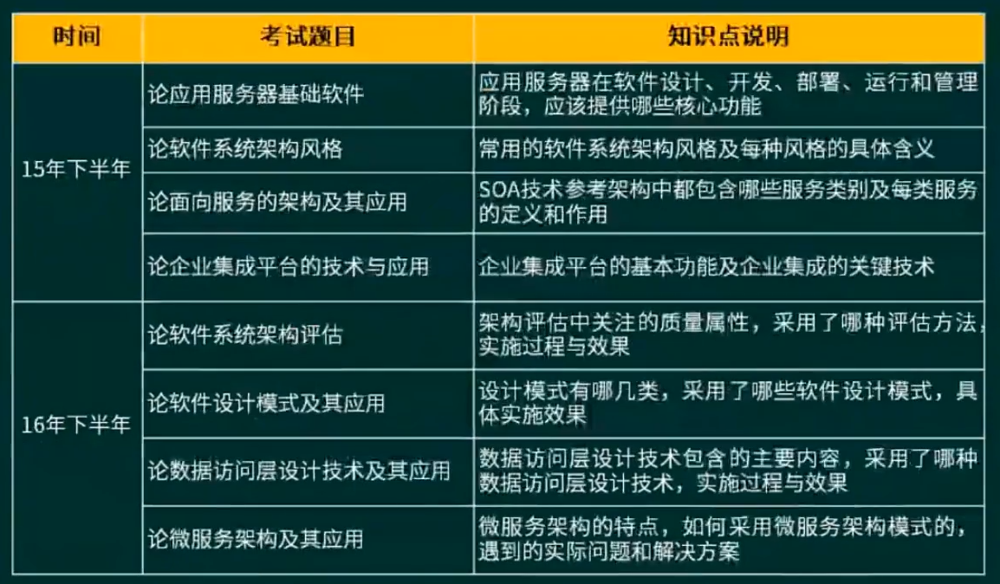
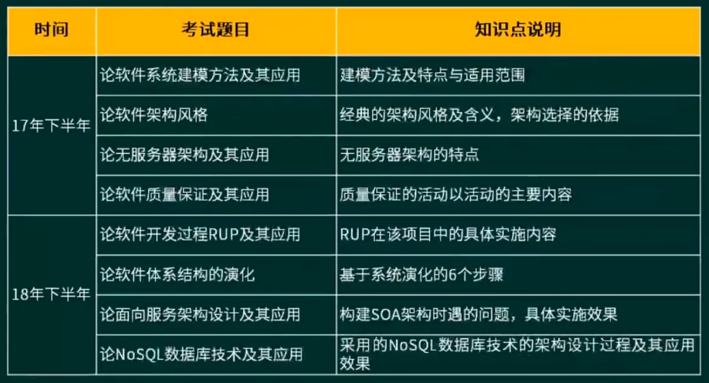
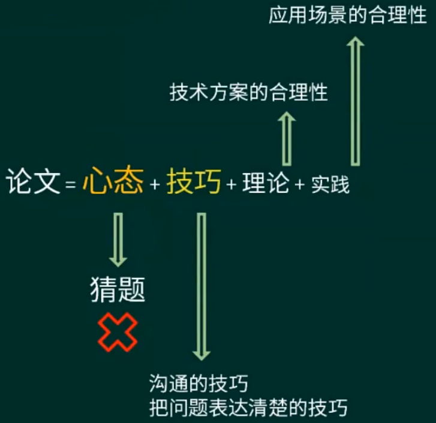

# 考试说明

## 科目

- 科目一：综合知识
  - 客观题：75道
  - 时间：150分钟
  - 特点：范围广，但是考试时间充足
- 科目二：案例分析
  - 主观题：5道大题（选3道）
  - 时间：90分钟
  - `第1道必答，后4道选答2道`
- 科目三：论文写作
  - 论文题：4道题选做1道
  - 时间：120分钟
  - `以往4选1，大概率调整为2选1`

## 考点

### 综合知识考点分布

| 知识点          | 分数    | 说明                                                                                                                          | 比例          |
|--------------|-------|-----------------------------------------------------------------------------------------------------------------------------|-------------|
| 计算机组成原理与体系结构 | 2-4   | 中断、存储器、并/串转换、寄存器、内存容量计算、磁盘文件读取、异步传输、CISC与RISC、Cache特点、虚拟存储器、总线、宿主机                                                          | 2.7%-5.3%   |
| 系统配置与性能评价    | 0-2   | 基准程序测试、计算机性能优化/性能评价、负载均衡、数据备份、MIPS                                                                                          | 0-2.7%      |
| 操作系统         | 6-8   | 概念、前趋图与PV操作、微内核、文件系统、页面置换算法、索引文件                                                                                            | 8%-10.7%    |
| 计算机网络        | 3-6   | 网络层次化设计、逻辑/物理网络设计、网络存储、综合布线、DNS服务                                                                                           | 4%-8%       |
| 数据库系统        | 4-9   | 数据库设计、ER模型、完整性约束、触发器、候选关键字、模式分解、分布式数据库、SQL语言、关系代数、数据仓库、范式、事务处理                                                              | 5.3%-12%    |
| 企业信息化战略与实施   | 3-8   | 商业智能、企业应用集成、EDI、企业门户、CRM、企业信息化方法、信息化“三流”                                                                                    | 4%-10.7%    |
| 软件工程         | 12-18 | 需求管理、敏捷方法、逆向工程、用例包含关系、UML图、界面设计、系统测试、黑盒测试、CMMI、螺旋模型、软件开发环境、软件重用、RUP、软件维护、RAD、面向对象设计原则                                       | 16%-24%     | 
| 项目管理         | 0-4   | 用户文档、配置项、项目管理工具、需求变更                                                                                                        | 0-5.3%      |
| 软件架构设计       | 22-28 | 设计模式、基于构件的开发模型、构件技术、MVC模型、架构设计阶段、架构设计基本概念、软件构件需求、ABSD、软件架构文档、架构复审、软件架构风格选择、架构模式、架构评估方法、CORBA、“4+1”视图、架构与质量属性、敏捷点与风险、ADL、中间件 | 29.3%-37.3% |
| 系统安全性与保密设计   | 2     | 安全策略、对称加密算法、网络安全漏洞、ARP、SNMP v3、PGP、PKI                                                                                      | 2.7%        |
| 法律法规与标准化     | 3     | 著作权保护期限、著作权法、侵权判定、标准类型、商标法、商业秘密                                                                                             | 4%          |
| 数学与经济管理      | 2     | 数学建模、转移矩阵、盈亏平衡点、线性规划、函数曲线                                                                                                   | 2.7%        |
| 专业英语         | 5     | 软件架构风格、软件架构、信息系统给设计、DFD                                                                                                     | 6.67%       |

### 案例分析

### 论文写作

#### 考点分析 - 考试大纲
- 系统建模
- 软件架构设计
- 系统设计
- 分布式系统设计
- 系统可靠性分析与设计
- 系统安全性和保密性设计

#### 历年考试情况

> 
> 
> - 不要猜题；要复用构件，但不要整篇复用
> - 不要抄范文，不要用网上的项目背景；宁可杜撰项目
> - 写文章前一定做好功课；理论重于实践
> - 做好准备工作之后，要勇于迈出第一步；万事开头难
> - 换个角度看论文；以论文写作技巧视频为依据，对论文进行自评