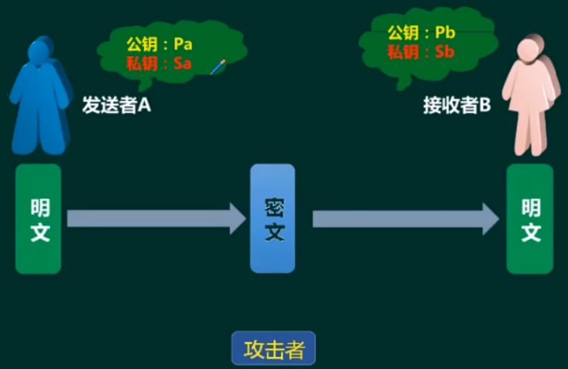
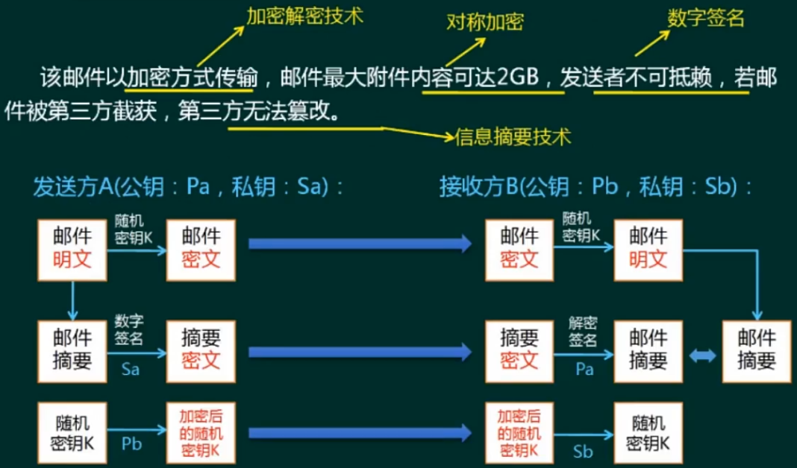
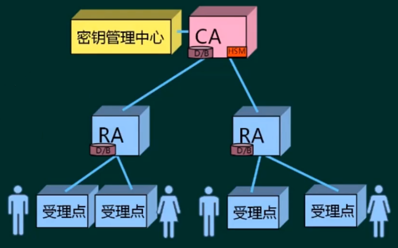
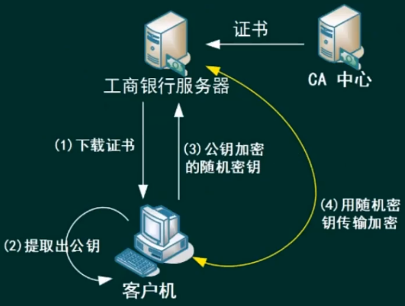

# 系统安全分析与设计

## 安全基础技术
### 对称与非对称加密
#### 对称加密 
对称加密算法就是传统的用一个密码进行加密和解密

缺陷：
- 加密强度不高（但效率高）
- 密钥分发困难

常见对称密钥算法：
- DES：替换+移位、56位密钥、64位数据块、速度快、密钥易产生
  - 3DES：两个56位密钥的K1、K2
    - 加密：K1加密 → K2解密 → K1加密
    - 解密：K1解密 → K2加密 → K1解密
- RC-5：RSA数据安全公司的很多产品都使用了RC-5
- IDEA算法：128密钥、64位数据块、比DES的加密性好对计算机功能要求相对较低，PGP
- AES算法：高级加密标准，又称Rijndael加密法，是美国政府使用的以中国区块加密标准

#### 非对称加密
对称加密算法就是传统的用一个密码进行加密和解密

缺陷：加密速度慢

常见的非对称加密算法：
- RAS：2048位（或1024位）密钥、计算量极大、难破解
- Elgamal：安全性依赖于计算有限域上离散对数这一难题
- ECC：椭圆曲线算法

> - Pa加密的只能Sa解密，Sa加密的只能Pa解密
> - A向B发送消息
>   - 从保密性的角度来看：如果使用Sa加密，因为Pb是公开的，所以起不到保密的作用（任何人都可以解密），如果使用Pb加密，则只能用Sb才能解开，就保证了发送消息的保密性
>   - 从防抵赖的角度来看：消息能使用Pa解开，那么说明它是经过了Sa的加密，而只有A持有Pa对应的私钥Sa，说明消息是A发过来的。这就是`数字签名`的应用，它可以识别发送者的身份，以及防抵赖。其中，用Sa加密的过程就是`签名`，而使用Pa解密的过程就是`验证签名`
> 
> `私钥一般用来签名和解密，反之，公钥一般用来验证签名和加密`

### 信息摘要
将明文通过`单向`散列函数处理，得到固定长度的散列值的算法

常用的消息摘要算法有MD5、SHA等，市场上广泛使用的MD5、SHA算法的散列值分别为128位和160位，由于SHA通常采用的密钥长度较长，一次安全性高于MD5

信息摘要一般用于保障数据的`完整性`，因为原文变，摘要也会变

### 数字签名
数字签名（又称公钥数字签名）是只有信息的发送者才能产生的别人无法伪造的一段数字串，这段数字串同时也是对信息的发送者发送信息真实性的一个有效证明。它是一种类似写在纸上的普通的物理签名，但是在使用了公钥加密领域的技术来实现的，用于鉴别数字信息的方法。一套数字签名通常定义两种互补的运算，一个用于签名，另一个用于验证。`数字签名是非对称密钥加密技术与数字摘要技术的应用`

#### 加密技术、信息摘要、数字签名的应用的例子

> 使用非对称加密方式加密对称密钥的技术称为`数字信封`

### 数字证书
- 证书的`版本信息`
- 证书的`序列号`，每个证书都有唯一的证书序列号
- 证书所使用的签名算法
- 证书的发行机构名称，命名规则一般采用X.500格式
- 正式的`有效期`，现在通过的证书一般采用UTC时间格式，它的计算范围为1950-2049
- 证书所有人的名称，命名规则一般采用X.500格式
- 证书所有人的`公开密钥`
- `证书发行者对证书的签名`（CA使用CA的私钥对数字证书进行签名，所以需要使用CA的公钥对数字证书来进行验证）

#### PKI公钥体系
- CA（Certificate Authority）认证中心
- RA（Registration Authority）注册审批机构
- 证书受理点
- 密钥管理中心-KMC

## 网络安全
### 安全协议
### 网络攻击
### 等级保护保准