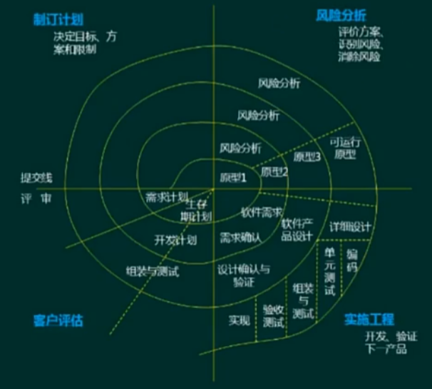
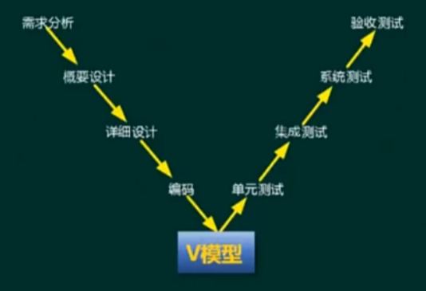
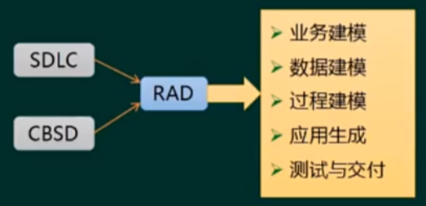

# 软件开发方法

## 软件开发方法

### 结构化法
- 用户至上
- 严格区分工作阶段，每阶段有任务与成果
- 强调系统开发过程的整体性与全局性
- 系统开发过程工程化，文档资料标准化
- 自顶向下，逐级分解（求精）

面向过程，不能灵活变动

### 原型法
- 适用于需求不明确的开发
- 包括抛弃型原型和进化型原型

用于需求分析阶段

### 面向对象方法
- 更好的复用性
- 关键在于建立一个全面、合理、统一的模型
- 分析、设计、实现三个阶段，界限不明确

### 面向服务方法
- SO方法有三个主要抽象级别：操作、服务、业务流程
- SOAD分为三个层次：基础设计蹭（底层服务构件）、应用结构层（服务之间的接口和服务级协定）和业务组织层（业务员流程建模和服务流程编排）
- 服务建模：分为服务发现、服务规约和服务实现三个阶段

## 软件开发模型

- `瀑布模型（SDLC）`  
  - 适合与需求明确的项目  
  - 
- 演化模型
- 增量模型
  - 
- `螺旋模型`
  - 适合与大型系统，引入了风险分析
  - 
- `原型模型`
  - 抛弃型原型（快速原型模型）
  - 进化型模型
- 喷泉模型
  - 面向对象模型
- V模型
  - 强调测试贯穿与始终的模型（测试尽早做、提前做）
  - 
- 迭代模型/迭代开发方法
- 快速应用开发（RAD）
  - 
- 构建组装模型/基于构件的开发方法（CBSD）
  - 构件库是快的核心
  - 优点：快、节省成本、可靠性高
  - 
- `统一过程/统一过程开发`
- `敏捷开发方法`
- 模型驱动的开发方法
- `基于架构的开发方法`

## 逆向工程
## 净室软件工程

# 需求工程

# 软件系统建模

# 软件设计

# 测试与评审

# 系统运行与维护